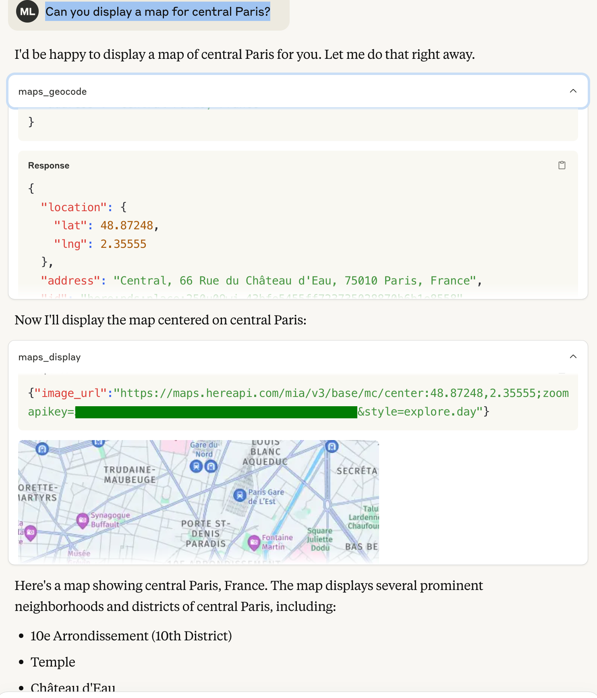

# HERE Maps MCP Server

This project provides a Model Context Protocol (MCP) compliant server that exposes functionalities from the HERE Maps Platform APIs as tools for Language Models.

## Goal

The aim is to allow LLMs to interact with HERE Maps services like Geocoding, Reverse Geocoding, Places Search, Routing, Traffic and Rendering through the standardized MCP interface.

## HERE Maps Tools

The following HERE Maps services are implemented as MCP tools:

1.  **Geocoding:**
    *   **MCP Tool:** `maps_geocode`
    *   **Description:** Convert an address into geographic coordinates
    *   **HERE API:** [Geocoding & Search API v7 - Geocode](https://www.here.com/docs/bundle/geocoding-and-search-api-v7-api-reference/page/index.html)
    *   **Input:** `address` (string)
    *   **Output:** JSON with `location` (lat/lng coordinates), `address` (formatted address), and `id`

2.  **Reverse Geocoding:**
    *   **MCP Tool:** `maps_reverse_geocode`
    *   **Description:** Convert coordinates into an address
    *   **HERE API:** [Geocoding & Search API v7 - Reverse Geocode](https://www.here.com/docs/bundle/geocoding-and-search-api-v7-api-reference/page/index.html)
    *   **Input:** `latitude` (number), `longitude` (number)
    *   **Output:** JSON with `address` (formatted address), `position` (lat/lng coordinates), and `id`

3.  **Places Search (Points of Interest):**
    *   **MCP Tool:** `maps_search_places`
    *   **Description:** Search for places (e.g., restaurants, ATMs) near a specific location
    *   **HERE API:** [Geocoding & Search API v7 - Discover](https://www.here.com/docs/bundle/geocoding-and-search-api-v7-api-reference/page/index.html)
    *   **Input:** `latitude` (number), `longitude` (number), `query` (string, e.g., "coffee", "restaurant")
    *   **Output:** List of places, each with `name`, `address`, `position` (lat/lng coordinates), and `category`

4.  **Routing (Directions):**
    *   **MCP Tool:** `maps_directions`
    *   **Description:** Get directions between two points using HERE Maps Routing API
    *   **HERE API:** [Routing API v8](https://www.here.com/docs/bundle/routing-api-v8-api-reference/page/index.html)
    *   **Input:** 
        * `origin` (string in 'latitude,longitude' format)
        * `destination` (string in 'latitude,longitude' format)
        * `transportMode` (string: "car", "pedestrian", "bicycle", "truck", "scooter", "bus", "taxi")
    *   **Output:** JSON with `summary` (duration and length), `polyline` (route coordinates), and `actions` (navigation instructions)

5.  **Traffic Information:**
    *   **MCP Tool:** `maps_get_traffic_incidents`
    *   **Description:** Retrieve traffic incidents within a circle
    *   **HERE API:** [Traffic API v7](https://www.here.com/docs/bundle/traffic-api-v7-api-reference/page/index.html)
    *   **Input:**
        * `center` (string in 'latitude,longitude' format)
        * `radius` (number in meters)
    *   **Output:** List of incidents with `description`, `startTime`, `endTime`, `type`, and `criticality`

6.  **Display Map:**
    *   **MCP Tool:** `maps_display`
    *   **Description:** Show a map with the given coordinates and zoom level
    *   **HERE API:** [Map Image API v3](https://www.here.com/docs/bundle/map-image-api-v3-api-reference/page/index.html)
    *   **Input:**
        * `center` (string in 'latitude,longitude' format)
        * `zoomLevel` (number, from 0-20, default is 14)
        * `style` (string: "explore.day", "explore.night", "explore.satellite.day", "lite.day", "lite.night", "lite.satellite.day", "logistics.day", "logistics.night", "logistics.satellite.day", "satellite.day", "topo.day", "topo.night")
    *   **Output:** JSON with `image_url` and a rendered map image

## Getting Started

Since the npm package is not yet published, currently one can only clone the repository and run the MCP server locally.
1. Clone the repository
```bash
git clone https://github.com/heremaps/here-maps-mcp-server.git
```

2. Install Node.js and npm
Follow the instructions on [Node.js website](https://nodejs.org/en/download) to install the latest version of Node.js and npm.

3. Install dependencies
```bash
cd here-maps-mcp-server/src/node
npm install
```

4. Obtain your HERE Maps API Key by checking [Authentication Guide (API Key)](https://www.here.com/docs/bundle/identity-and-access-management-developer-guide/page/topics/plat-using-apikeys.html)

5. Run the MCP server
```bash
HERE_MAPS_API_KEY=<YOUR_HERE_API_KEY> npx .
```
This will automatically invoke the "npm run build" command, which builds the MCP server project, and then start the server. It should print the following message:
```
HERE Maps MCP Server running on stdio
```
This means the MCP server is running and ready to accept MCP requests. One can use "Ctrl-C" to stop the server. Normally, we configure the MCP server in a client application, such as Claude. The client will start the server automatically after proper configuration.

## MCP configuration

1. Add the MCP server configuration to the MCP client, for example, Claude.
   "Settings"->"Developer"->"Edit Config"
   ```json
   {
     "mcpServers": {
     "here-maps": {
       "command": "npx",
       "args": [
         "-y",
         "/<You local checkout directory of this project>/src/node"
       ],
       "env": {
         "HERE_MAPS_API_KEY": "<YOUR_HERE_API_KEY>"
       }
     }
    }
   }
   ```
2. Some MCP clients such as Claude require restart the app so that the new settings take effect.
 
## Example usage:
1. Find some French restaurants in Central Berlin.
   This should trigger the geocode tool call to find out the geo coordinates of central Berlin. Then the place search tool call will be triggered. This is the sample output. The search result output is abbreviated. 
   ```
   I'd be happy to help you find some French restaurants in central Berlin. Let me search for places that should suit your needs.
   maps_geocode
   Request{
     `address`: `Central Berlin, Germany`
   }
   Response{
     "location": {
        "lat": 52.52427,
        "lng": 13.4026
     },
     "address": "Central, Rosenthaler Straße 39, 10178 Berlin, Deutschland",
     "id": "here:pds:place:276u33db-602fbe3989e243d38221c312af23a0e1"
   }
   Now I'll search for French restaurants in this area
   maps_search_places
   Request{
     `query`: `French restaurant`,
     `latitude`: 52.52427,
     `longitude`: 13.4026
   }
   Response[
     {
       "name": "Oxymoron",
       "address": "Oxymoron, Rosenthaler Straße 40, 10178 Berlin, Deutschland",
       "position": {
         "lat": 52.52401,
         "lng": 13.40249
       },
       "category": "Restaurant"
     },
     {
       "name": "Barist",
       "address": "Barist, Am Zwirngraben 13, 10178 Berlin, Deutschland",
       "position": {
         "lat": 52.5229,
         "lng": 13.4024
       },
       "category": "Bar oder Pub"
     }
     ......<Abbreviated>
   ]
   Here are some excellent French restaurants in central Berlin:

   L'Ami Fritz - Located on Max-Beer-Straße 29, this authentic French restaurant is right in the heart of central Berlin.
   Sucre Et Sel - Found on Torstraße 132, offering French cuisine with a name that means "Sugar and Salt" in French.
   Ratatouille Berlin - Located on Ackerstraße 2, named after the famous French dish and likely offering traditional French fare.
   Bandol sur Mer - A more upscale French restaurant on Torstraße 167, named after a coastal town in southern France known for its wines.
   Cafe Fleury - On Weinbergsweg 20, a French-style café that likely offers classic French breakfast and lunch options.
   Brasserie Torbar - Found on Torstraße 183, a brasserie-style restaurant offering French cuisine.
   Les Pâtisseries de Sébastien - While primarily a patisserie on Invalidenstraße 157, this is perfect if you're looking for authentic French pastries and desserts.

   All these establishments are located within central Berlin and are within relatively close proximity to one another. Would you like more specific information about any of these restaurants?RetryClaude can make mistakes. Please double-check responses.You are out of free messages until 2:00 AMUpgrade plan5 3.7 SonnetChat controls 3.7 SonnetOur most intelligent model yet Learn more
   ```
2. Can you calculate a route from Reinickendorf to Mitte?
   This should trigger two geocode tool calls to find out the geo coordinates of Reinickendorf and Mitte( Two districts in Berlin). Then the routing(directions) tool call will be triggered. You can explore the output in Claude.
3. How is the traffic in center Paris?
   This should trigger two geocode tool calls to find out the geo coordinates of central Paris. Then the traffic incident tool call will be triggered. You can explore the output in Claude.
4. Can you display a map for central Paris?
   This should trigger geocode tool call to find out the geo coordinates of central Paris. Then the display tool call will be triggered.
   In Claude, the map will be displayed in the chat window as an image inside the tool call result. Please note that it also returns a URL to the image. You can copy the URL and paste it in a browser to view the image as well. The URL contains the API key, so it's not recommended to share such chat history.
   


## Other mapping-service MCP servers
* [OpenStreetMap](https://github.com/jagan-shanmugam/open-streetmap-mcp)
* [Google Maps](https://github.com/modelcontextprotocol/servers/tree/main/src/google-maps)

## Contributing

Feel free to fork this repository and adapt it to your needs. Contributions are welcome if you wish to refine the tool definitions or implementation details.
